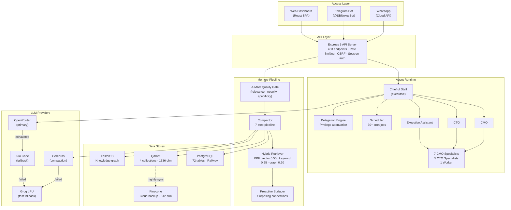
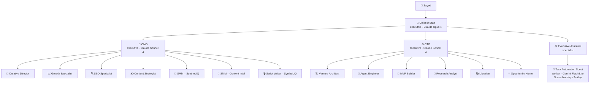
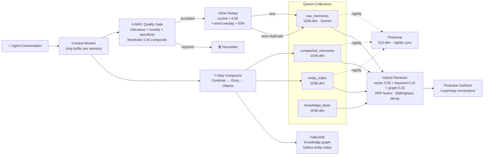
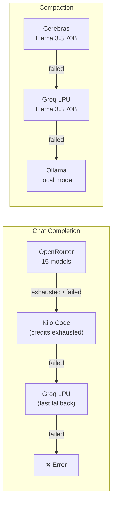

# SB-OS — Personal Operating System

> Full-stack personal OS for managing multiple business ventures, projects, tasks, health, knowledge, and trading — powered by **18 AI agents** with persistent long-term memory.

Built for one founder: **Sayed Baharun** (Dubai, UAE).

---

## At a Glance

| Metric | Count |
|--------|-------|
| TypeScript files | **432** (193 server + 239 client) |
| Database tables | **72** |
| API endpoints | **403** across 49 route files |
| Client pages | **35** |
| AI agents | **18 active** (hierarchical, delegating, memory-enabled) |
| LLM providers | **5** (OpenRouter → Kilo → Groq → Cerebras → Ollama) |
| Available AI models | **15** across Anthropic, OpenAI, Google, DeepSeek, Meta |
| Memory stores | **4** (PostgreSQL + Qdrant + Pinecone + FalkorDB) |
| Embedding model | **Gemini Embedding 001** (MTEB 68.32, 8K context, 8 task types) |
| Deployment | **Railway** (auto-deploy on push to `main`) |

---

## Capabilities

- **Multi-venture management** — projects, phases, tasks, docs, and AI agents scoped per venture
- **18 AI agents** — hierarchical team (Chief of Staff → CMO/CTO → specialists → workers) with delegation, memory, and 30+ scheduled jobs
- **4-store memory pipeline** — Qdrant (local vector) + Pinecone (cloud backup) + FalkorDB (knowledge graph) + PostgreSQL (relational)
- **Gemini Embedding 001** — 8 task-type routing modes (RETRIEVAL_DOCUMENT, RETRIEVAL_QUERY, SEMANTIC_SIMILARITY, etc.) with Matryoshka 1536-dim
- **A-MAC quality gate** — pre-storage scoring (relevance + novelty + specificity), rejects noise before it hits the vector store
- **Ebbinghaus memory decay** — importance-scaled half-lives (365d/60d/14d), spaced-repetition boost per retrieval, 20% floor for critical memories
- **Inline dedup** — cosine > 0.92 + word overlap > 50% → update existing point instead of storing duplicate
- **Proactive memory surfacing** — push-based "surprising connections" surfaced from conversation context
- **7-step compaction pipeline** — Cerebras → Groq → Ollama cascade for fast session summarization
- **5 LLM providers** — automatic failover: OpenRouter → Kilo Code → Groq → error
- **Telegram bot** (@SBNexusBot) — 12 commands, `@agent-slug` routing, NLP intents, nudge engine
- **WhatsApp Cloud API** — bidirectional, Arabic auto-detect
- **WHOOP integration** — OAuth2 health data auto-sync (recovery, HRV, strain, sleep)
- **Trading module** — strategy templates, session tracking (London/NY/Asian), P&L journal
- **Knowledge Hub** — hierarchical docs with BlockNote editor, RAG search, web clipping
- **35 pages** — Command Center, Health Hub, Venture HQ, Deep Work, Trading, AI Chat, and more

---

## System Architecture



---

## Tech Stack

| Layer | Technology |
|-------|-----------|
| **Frontend** | React 18, Tailwind CSS v3, shadcn/ui, TanStack Query, Wouter |
| **Backend** | Express 5, Node.js 20+, TypeScript 5.9 |
| **Database** | Railway PostgreSQL, Drizzle ORM, 72 tables |
| **Embeddings** | Gemini Embedding 001 (primary), OpenRouter text-embedding-3-small (fallback) |
| **Vector DB** | Qdrant — 4 collections: `raw_memories`, `compacted_memories`, `entity_index`, `knowledge_base` |
| **Graph DB** | FalkorDB — entity relationships, fulltext index, co-occurrence tracking |
| **Cloud Vector** | Pinecone — nightly sync from Qdrant, 512-dim, 3 namespaces |
| **Fast LLM** | Cerebras API — Llama 3.3 70B, compaction summarization |
| **Cheap LLM** | Groq LPU — `llama-3.3-70b-versatile`, $0.06–0.18/1M tokens |
| **Primary LLM** | OpenRouter — 15 models across 5 providers |
| **Bot** | Telegraf (Telegram) + WhatsApp Cloud API |
| **Build** | Vite (client), esbuild (server) |
| **Deploy** | Railpack → Railway (auto-deploy from `main`) |

---

## Agent Hierarchy



**Model tiers:**
- `top` → Claude Opus 4 (executive reasoning only)
- `mid` → Claude Sonnet 4 (managers)
- `fast` → Gemini 2.5 Flash Lite or Groq Llama 3.3 70B (specialists/workers)

---

## Memory Pipeline



**Ebbinghaus decay half-lives:**

| Importance | Half-life | Notes |
|------------|-----------|-------|
| ≥ 0.8 | 365 days | Critical decisions, never below 20% strength |
| 0.4 – 0.79 | 60 days | Standard memories |
| < 0.4 | 14 days | Low-value, prune quickly |

Each retrieval extends half-life by 10% (capped at 2×) — spaced-repetition effect.

---

## LLM Provider Cascade



**Cost comparison (per 1M tokens):**

| Provider | Model | Input | Output |
|----------|-------|-------|--------|
| Anthropic | Claude Opus 4 | $15.00 | $75.00 |
| Anthropic | Claude Sonnet 4 | $3.00 | $15.00 |
| OpenAI | GPT-4o | $2.50 | $10.00 |
| Groq | Llama 3.3 70B | $0.06 | $0.06 |
| Cerebras | Llama 3.3 70B | — | — |

---

## Pages

| Category | Pages |
|----------|-------|
| **Dashboard** | Command Center V2, Live Tasks, Weekly Planning |
| **Ventures** | Venture HQ, Venture Detail, Venture Lab |
| **Tasks & Work** | All Tasks, Deep Work, Daily, Review Queue |
| **Knowledge** | Knowledge Hub, Doc Detail, Research Inbox |
| **Health** | Health Hub, Nutrition Dashboard |
| **Finance** | Finance |
| **AI & Agents** | AI Chat, Agents, Agent Detail, Delegation Log |
| **Daily Rituals** | Morning Ritual, Evening Review |
| **Life** | Shopping, Books, Calendar, Capture, People |
| **Trading** | Trading Dashboard |
| **Settings** | Settings, AI Settings, Integrations, Categories, External Agents, Notifications |

---

## Telegram Bot

**@SBNexusBot** — 12 commands, `@agent-slug` routing, and Arabic/English NLP.

| Command | Description |
|---------|-------------|
| `/start` | Welcome + usage guide |
| `/agents` | List all 18 agents |
| `/briefing` | Morning intelligence via Chief of Staff |
| `/capture <text>` | Add to inbox immediately |
| `/today` | Top 3 outcomes + urgent tasks + inbox count |
| `/tasks` | In-progress and next tasks (numbered, max 10) |
| `/done <number>` | Mark task done by number |
| `/shop <item> [#category]` | Add to shopping list |
| `/clip <url>` | Clip web article to Knowledge Hub + embed for RAG |
| `/emails` | Today's email triage (urgent / action needed / info) |
| `/email <id>` | Full triaged email + suggested reply |
| `/reply <id> <msg>` | Send Gmail reply |
| `@agent-slug <msg>` | Route message directly to any named agent |
| Plain text | Routes to Chief of Staff |

---

## Quick Start

```bash
# Clone
git clone https://github.com/sayedbaharun/SBOS.git sbos
cd sbos

# Install
npm install

# Configure environment
cp .env.example .env
# Required: DATABASE_URL, SESSION_SECRET
# AI features: OPENROUTER_API_KEY
# Memory: QDRANT_URL, PINECONE_API_KEY, FALKORDB_URL, GOOGLE_AI_API_KEY
# Groq fallback: GROQ_API_KEY
# Telegram: TELEGRAM_BOT_TOKEN, AUTHORIZED_TELEGRAM_CHAT_IDS

# Push database schema
npm run db:push

# Start development server (http://localhost:5000)
npm run dev
```

After first run, seed all 18 agents:
```bash
curl -X POST http://localhost:5000/api/agents/admin/seed
```

Check provider health (OpenRouter, Kilo, Groq all in one call):
```bash
curl http://localhost:5000/api/providers/health
```

---

## Documentation

| Document | Description |
|----------|-------------|
| [`CLAUDE.md`](./CLAUDE.md) | **Primary reference** — full technical spec, all APIs, schema, agent system |
| [`docs/README.md`](./docs/README.md) | Documentation index |
| [`docs/system/01-architecture-overview.md`](docs/system/01-architecture-overview.md) | Architecture deep-dive |
| [`docs/system/02-memory-and-intelligence.md`](docs/system/02-memory-and-intelligence.md) | Memory pipeline, RAG, Gemini embeddings |
| [`docs/system/03-agent-operating-system.md`](docs/system/03-agent-operating-system.md) | Agent hierarchy, delegation engine, tools |
| [`docs/system/04-infrastructure-resilience.md`](docs/system/04-infrastructure-resilience.md) | Circuit breakers, backoff, tool loop detection |
| [`docs/system/05-telegram-and-channels.md`](docs/system/05-telegram-and-channels.md) | Telegram commands, NLP, webhooks |
| [`docs/reference/api-reference.md`](docs/reference/api-reference.md) | 403 REST endpoints by domain |
| [`docs/reference/database-schema.md`](docs/reference/database-schema.md) | 72 tables with key columns |
| [`docs/guides/user-guide.md`](docs/guides/user-guide.md) | Daily execution workflows |
| [`docs/guides/agent-operating-rhythm.md`](docs/guides/agent-operating-rhythm.md) | Agent daily/weekly schedule (Dubai timezone) |

---

## License

Private project — not open source.
